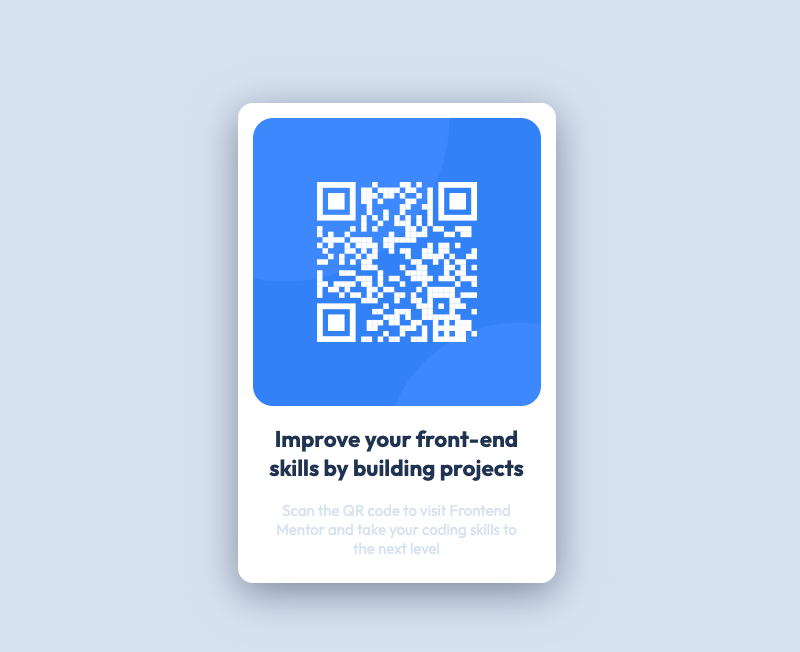

# Frontend Mentor - QR code component solution

This is a solution to the [QR code component challenge on Frontend Mentor](https://www.frontendmentor.io/challenges/qr-code-component-iux_sIO_H). Frontend Mentor challenges help you improve your coding skills by building realistic projects. 

## Table of contents

- [Overview](#overview)
  - [Screenshot](#screenshot)
  - [Links](#links)
- [My process](#my-process)
  - [Built with](#built-with)
  - [What I learned](#what-i-learned)
  - [Continued development](#continued-development)
  - [Useful resources](#useful-resources)
- [Author](#author)
- [Acknowledgments](#acknowledgments)

**Note: Delete this note and update the table of contents based on what sections you keep.**

## Overview

### Screenshot




### Links 

- Solution URL: [Add solution URL here](https://www.frontendmentor.io/solutions/qr-code-component-solution-n3Be02hkGh)
- Live Site URL: [Add live site URL here](https://craigwolfe.github.io/QR-code-component-challenge/)

## My process

### Built with

- Semantic HTML5 markup
- CSS custom properties
- Flexbox
- Mobile-first workflow


### What I learned

I learned that I don't know Flexbox as well as I thought I did. I also learned how to get measurements from Figma design software.

To see how you can add code snippets, see below:

```html
  <div class="container">
    <section class="item">
      
    </section>
    <section class="item-body">
      <h1>Improve your front-end <br>skills by building projects</h1>
      <p>Scan the QR code to visit Frontend <br> Mentor and take your coding skills to <br> the next level</p>
    </section>
```
```css
.container{
  max-width: 320px;
  height: 450px;
  display: flex;
  flex-direction: column;
  align-items: center;
  background-color: #ffffff;
  box-shadow: 0 10px 40px hsl(220, 15%, 55%);
  padding: 15px;
  border-radius: 15px;
}
```


### Continued development

I really want to dig more into Flexbox. It's still confusing. May be watch a few more videos or some courses on Scrimba and or LinkedIn learning.

**Note: Delete this note and the content within this section and replace with your own plans for continued development.**

### Useful resources

- [Resource 1](https://www.youtube.com/watch?v=jQr-bM6-XTc&t=21271s) - This helped me with Flexbox. I really liked this persons content hope it will help me going forward.

## Author

- Github - [Craig Wolfe](https://github.com/craigwolfe)
- Frontend Mentor - [@craigwolfe](https://www.frontendmentor.io/profile/craigwolfe)


## Acknowledgments
Full Stack Zach from Youtube (https://www.youtube.com/@zachgoll)